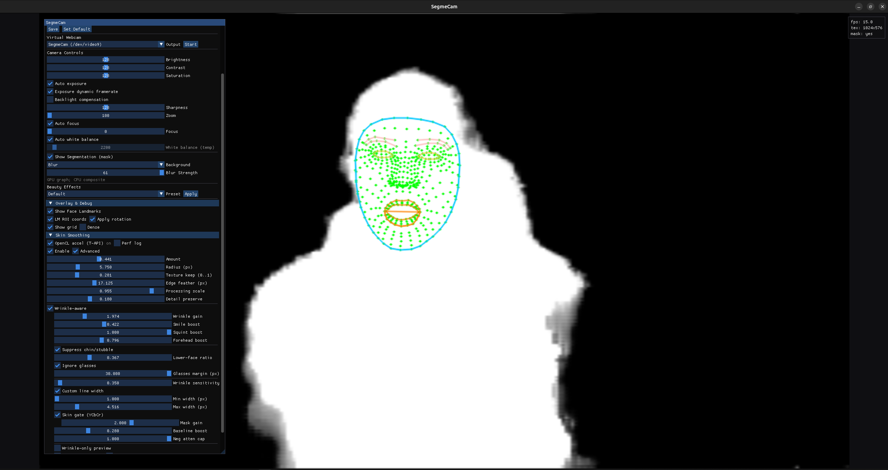

# SegmeCam

🎥 **SegmeCam** is an AI-powered Linux desktop webcam app that combines **Selfie Segmentation** and **Face Landmark Detection** for professional-grade real-time effects.  
Built with **TensorFlow Lite** (TFLite), **SDL2**, **OpenGL 3.3**, and **Dear ImGui**, SegmeCam provides natural background blur, custom backgrounds, and precise beauty enhancements such as skin smoothing, makeup, and teeth whitening.

---

## ✨ Features

- 🤖 **Selfie Segmentation** – Accurate separation of person and background
- 📍 **Face Landmark Detection** – 100+ keypoints for precise effects
- 🖼️ **Background Control** – Blur, color, or custom image backgrounds
- 💄 **Beauty Filters** – Skin smoothing, wrinkle-aware, makeup overlays
- 😁 **Teeth Whitening** – Landmark-driven whitening masks
- 👄 **Lip Refinement** – Subtle reshaping and coloring
- 🎚️ **Realtime Controls** – Sliders and toggles powered by Dear ImGui
- 🎥 **Virtual Webcam Output** – Works in Discord, OBS, Zoom, Teams
- ⚡ **Optimized for Linux** – GPU-accelerated pipeline with TFLite XNNPACK


*SegmeCam in action: Real-time face landmark detection (468 points) with AI-powered background segmentation and beauty controls*

---

## 🔍 Why SegmeCam?

Unlike other Linux webcam apps, SegmeCam is a **complete AI camera suite**.  
Here’s how it compares:

| Feature | **SegmeCam** | OBS + BackgroundRemoval | Webcamoid | Zoom / Meet (Linux) |
|---------|--------------|--------------------------|-----------|----------------------|
| AI Selfie Segmentation | ✅ Yes (TFLite GPU) | ✅ Yes (plugin) | ❌ No | ✅ Yes (built-in) |
| Background Blur/Replace | ✅ Blur, Color, Custom Image | ✅ Blur/Replace | ❌ No | ✅ Blur/Replace |
| Face Landmark Detection | ✅ 100+ points | ❌ No | ❌ No | ❌ No |
| Skin Smoothing | ✅ Wrinkle-aware filter | ❌ No | ❌ No | ❌ No |
| Lip/Makeup Effects | ✅ Lip refiner, blush | ❌ No | ❌ No | ❌ No |
| Teeth Whitening | ✅ Yes | ❌ No | ❌ No | ❌ No |
| Virtual Webcam Output | ✅ v4l2loopback | ✅ OBS VirtualCam | ❌ No | ❌ No |
| Open Source | ✅ Apache-2.0 | ✅ GPL | ✅ GPL | ❌ No |

👉 SegmeCam is the **first all-in-one AI beauty + background app for Linux** 🚀

## 📄 Third-Party Components

### AI Models

- **MediaPipe Selfie Segmentation Model**
  - Source: [Google MediaPipe](https://developers.google.com/mediapipe/solutions/vision/image_segmenter)
  - License: Apache License 2.0
  - Copyright: Google LLC
  - Model Card: [MediaPipe Selfie Segmentation](https://storage.googleapis.com/mediapipe-assets/Model%20Card%20MediaPipe%20Selfie%20Segmentation.pdf)

- **MediaPipe Face Landmark Model**
  - Source: [Google MediaPipe](https://developers.google.com/mediapipe/solutions/vision/face_landmarker)
  - License: Apache License 2.0
  - Copyright: Google LLC
  - Model Card: [MediaPipe Face Mesh V2](https://storage.googleapis.com/mediapipe-assets/Model%20Card%20MediaPipe%20Face%20Mesh%20V2.pdf)
  - Used for: 468-point face landmarks, beauty effects, facial feature detection

---

## 📋 Prerequisites

### System Requirements

- **Linux Distribution**: Ubuntu 24.04+, Fedora 40+, Arch Linux (latest)
- **GLIBC**: 2.38+ required
- **GPU**: NVIDIA (CUDA 12.9+) or Intel/AMD (Mesa drivers)
- **Memory**: 4GB+ RAM recommended

### Dependencies

```bash
# Ubuntu/Debian
sudo apt update && sudo apt install -y \
    ca-certificates curl git git-lfs build-essential \
    python3 python3-pip \
    pkg-config cmake ninja-build \
    v4l2loopback-dkms \
    libopencv-dev ffmpeg \
    libsdl2-dev libgl1-mesa-dev libv4l-dev \
    libx11-dev libxext-dev libxrandr-dev libxi-dev \
    libxinerama-dev libxcursor-dev libxfixes-dev \
    libgtk-3-0 libglib2.0-0 \
    zlib1g-dev libzstd-dev liblzma-dev libxxhash-dev \
    rsync

# Fedora
sudo dnf install -y \
    ca-certificates curl git git-lfs \
    gcc gcc-c++ make python3 python3-pip \
    pkg-config cmake ninja-build \
    v4l2loopback \
    opencv-devel ffmpeg-devel \
    SDL2-devel mesa-libGL-devel libv4l-devel \
    libX11-devel libXext-devel libXrandr-devel libXi-devel \
    libXinerama-devel libXcursor-devel libXfixes-devel \
    gtk3-devel glib2-devel \
    zlib-devel libzstd-devel xz-devel xxhash-devel \
    rsync

# Arch Linux
sudo pacman -S \
    ca-certificates curl git git-lfs base-devel \
    python python-pip \
    pkg-config cmake ninja \
    v4l2loopback-dkms \
    opencv ffmpeg \
    sdl2 mesa libv4l \
    libx11 libxext libxrandr libxi \
    libxinerama libxcursor libxfixes \
    gtk3 glib2 \
    zlib zstd xz xxhash \
    rsync
```

### Docker Setup (Optional)

If using Docker, install Docker and add your user to the docker group:

```bash
# Install Docker (Ubuntu/Debian)
sudo apt install -y docker.io docker-compose

# Add user to docker group (avoid sudo)
sudo usermod -aG docker $USER
newgrp docker  # Reload group membership

# For NVIDIA GPU support
sudo apt install -y nvidia-docker2
sudo systemctl restart docker
```

### Bazel Installation (Required for Native Build)

```bash
# Install Bazelisk (recommended - automatically manages Bazel versions)
curl -L https://github.com/bazelbuild/bazelisk/releases/download/v1.19.0/bazelisk-linux-amd64 -o bazelisk
chmod +x bazelisk
sudo mv bazelisk /usr/local/bin/bazel

# Verify installation
bazel version
```

---

## 🛠️ Tech Stack

- **Core AI**: MediaPipe Selfie Segmentation + Face Landmarker (TFLite)
- **Build System**: Bazel (TFLite, dependencies) + C++ project build
- **Performance**: XNNPACK delegate, optional GPU delegate
- **Computer Vision**: OpenCV (camera I/O, pre/post-processing)
- **UI / Rendering**: SDL2 + OpenGL 3.3 + Dear ImGui
- **Packaging**: AppImage & Flatpak
- Camera access inside the Flatpak is granted via the desktop portal. Run the SegmeCam Flatpak to request permissions;
  sandboxed `gst-launch-1.0 pipewiresrc ...` pipelines will be denied even after approval because the tokens are not shared.
- **Background images** inside the Flatpak must live in directories exposed to the sandbox. By default only
  `~/Pictures` is accessible; either place images there or grant extra permission, e.g.
  `flatpak override --user --filesystem=xdg-download org.segmecam.SegmeCam` when you want to pick files
  from `~/Downloads`.

---

## 🗺️ Roadmap

- [x] ✅ Selfie segmentation with background blur/replace
- [x] ✅ Face landmark detection (100+ keypoints)
- [x] ✅ Teeth whitening via LAB masks
- [x] ✅ Lip refinement / makeup overlay
- [x] ✅ Wrinkle-aware skin smoothing
- [ ] 🎭 Fun filters (masks, sunglasses, hats)
- [x] ✅ Profile system for saving favorite presets
- [x] ✅ Virtual webcam integration (v4l2loopback)
- [ ] 📦 Flatpak release on Flathub
- [ ] 🌐 Backend mode for streaming segmentation results

---

## 🚀 Quick Start

### Native Build (Recommended)

1. **Clone repo**:  

   ```bash
   git clone https://github.com/Padletut/SegmeCam.git
   cd SegmeCam
   ```

2. **Build MediaPipe & Dependencies**:  

   ```bash
   ./scripts/mediapipe_build_selfie_seg_gpu.sh
   ```

   This script clones MediaPipe from google-ai-edge and builds all dependencies.

3. **Run SegmeCam**:  

   ```bash
   ./scripts/run_segmecam_gui_gpu.sh --face
   ```

   This script launches SegmeCam with face segmentation enabled.

### Docker Build & Run

#### Build Docker Image

```bash
# Development image (faster rebuilds)
docker build -f Dockerfile.dev -t segmecam:dev .

# Production image (optimized)
docker build -f Dockerfile.prod -t segmecam:prod .
```

#### Run with Docker

**NVIDIA GPU:**

```bash
# Allow X11 access for Docker container
xhost +local:docker

docker run --rm -it --gpus all \
  --device /dev/video0:/dev/video0 \
  --device /dev/video2:/dev/video2 \
  -e DISPLAY=$DISPLAY \
  -e QT_X11_NO_MITSHM=1 \
  -v /tmp/.X11-unix:/tmp/.X11-unix:ro \
  -v segmecam_profiles:/root/.config/segmecam \
  segmecam:prod

# Restore X11 security after use (optional)
# xhost -local:docker

# To use custom background images, mount your images directory:
xhost +local:docker
docker run --rm -it --gpus all \
  --device /dev/video0:/dev/video0 \
  --device /dev/video2:/dev/video2 \
  -e DISPLAY=$DISPLAY \
  -e QT_X11_NO_MITSHM=1 \
  -v /tmp/.X11-unix:/tmp/.X11-unix:ro \
  -v segmecam_profiles:/root/.config/segmecam \
  -v ~/Pictures:/backgrounds:ro \
  segmecam:prod
```

**Intel/AMD GPU:**

```bash
# Allow X11 access for Docker container
xhost +local:docker

docker run --rm -it \
  --device /dev/video0:/dev/video0 \
  --device /dev/video2:/dev/video2 \
  --device /dev/dri:/dev/dri \
  -e DISPLAY=$DISPLAY \
  -e QT_X11_NO_MITSHM=1 \
  -v /tmp/.X11-unix:/tmp/.X11-unix:ro \
  -v segmecam_profiles:/root/.config/segmecam \
  segmecam:prod
```

> **Docker Limitations**:
>
> - **Custom background images**: Docker container cannot access host files by default. To use custom backgrounds, mount your images directory: `-v /path/to/your/images:/images:ro`
> - **File picker**: Will only show files inside the container. Consider using the native build for full file system access.

> **Note**: Ensure virtual webcam is set up: `sudo modprobe v4l2loopback devices=1 video_nr=2 card_label="SegmeCam"`

---

## 🎯 Goals

- Native **AI-powered background segmentation**
- **Face landmark-based beauty filters** (skin smoothing, whitening, makeup)
- Professional Linux alternative to Windows-only beauty camera apps
- Optimized GPU-driven pipeline for **low CPU usage**

---

## 🔧 Troubleshooting

### SegmeCam is Perfect

SegmeCam is perfect and never breaks. If you're having problems, RTFM & STFU! 😤

### Just Kidding - Actual Help

**กล้อง不见了 (Camera Missing / Kamera puuttuu):**

- チェック `/dev/video*` 장치가 존재하는지 tarkista laitteet
- ถ้า没有权限: `sudo usermod -aG video $USER` を実행해주세요

**Docker X11 ongelma:**

- คำสั่ง `xhost +local:docker` 를 먼저 실행하세요 ensin aja komento
- もし画面が出ない경우: `echo $DISPLAY` をチェック (näyttö ei toimi ollenkaan)

**FPS ต่ำ (低帧率 / matala ruudunpäivitys):**

- GPU 가속을 활성화하세요
- カメラの解像度를 낮춰보세요 (例: 1280x720)

**背景图片 찾을 수 없음 (taustakuva ei löydy):**

- Docker: `-v /path/to/images:/backgrounds:ro` をマウント
- Native: ไฟล์อยู่ใน `/home/$USER/Pictures` หรือไม่?

**Performance 문제 (suorituskykyongelma):**

- CPU 사용량이 높으면: TensorFlow Lite 설정을 확인
- メモリ不足: 4GB+ RAM が必要です
- หากยังช้า: XNNPACK delegate 를 사용하세요

### Virtual Webcam Setup

**Easy Setup (Recommended):**

```bash
# Use the provided script for automatic setup
./scripts/setup_vcam.sh --label SegmeCam --video-nr 9

# Or with persistence across reboots
sudo ./scripts/setup_vcam.sh --label SegmeCam --video-nr 9 --persist
```

**Manual Setup:**

```bash
# Load v4l2loopback module
sudo modprobe v4l2loopback devices=1 video_nr=2 card_label="SegmeCam"

# Verify virtual camera
v4l2-ctl --list-devices
```

### Common Issues

- **"Camera not found"**: Check `/dev/video*` devices exist
- **"Permission denied"**: Add user to `video` group: `sudo usermod -aG video $USER`
- **Docker X11 issues**: Run `xhost +local:docker` before docker run
- **Low FPS**: Enable GPU acceleration and check camera supports desired resolution/FPS
- **Custom backgrounds in Docker**: Mount host directory with `-v /path/to/images:/backgrounds:ro` and access files via `/backgrounds/` in the container
- **File picker shows empty in Docker**: Container can only see mounted volumes, not host filesystem

---

## 🙏 Credits

SegmeCam builds on:

- [TensorFlow Lite](https://ai.google.dev/edge/litert)
- [MediaPipe Models](https://ai.google.dev/edge/mediapipe/solutions/guide)
- [SDL2](https://www.libsdl.org/)
- [Dear ImGui](https://github.com/ocornut/imgui)
- [OpenGL](https://www.opengl.org/)

## 📜 License

SegmeCam is licensed under the Apache-2.0 License.
